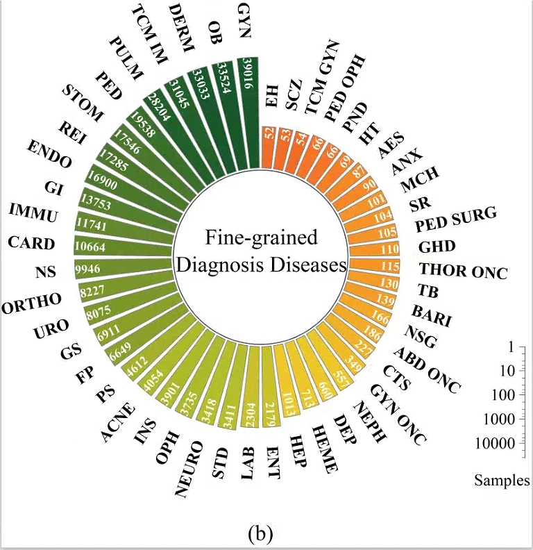

# Code

## Environment

* python  3.7
* torch  1.7.1
* transformers   4.10.1
* numpy 1.19.5

## Usage

```
python main.py 
```

## Evaluation Metrics

Accuracy, Macro-F1 (F1), Macro-Precision (P), Macro-Recall (R), and Matthews Correlation Coefficient (MCC)

# Datasets

We have collected millions of medical conversations from an online medical consultation portal, each tagged with a department and a disease label. To ensure data quality, we removed abnormally short dialogues and filtered out noise, resulting in 808,879 samples. From this dataset, we constructed a Triage Dataset comprising 407,060 samples distributed across 14 departments. Furthermore, we eliminated disease categories with fewer than 50 samples and selected records with detailed symptom descriptions and diagnostic results, creating a fine-grained Diagnosis Dataset with nearly 350,000 samples spanning 48 diseases. Figures (a) and (b) show the category distributions of the Triage Dataset and the Diagnosis Dataset, respectively. We use specialized medical abbreviations for departments and diseases, such as OB for Obstetrics and GYN for Gynecology. Despite data filtering and balancing efforts, the category distribution remains uneven, reflecting real-world clinical scenarios where some diseases are rare.




The raw texts and preprocessed data will be publicly available in the near future. If you want to use this dataset, please request my supervisor at qkpeng@xjtu.edu.cn.


